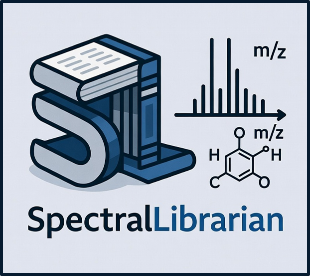

# SpectralLibrarian

**State-of-the-art mass spectrometry & chemoinformatics toolkit.**

<p align="left">
  
</p>


A comprehensive Python library for adduct analysis, spectral similarity computation, spectral library management, and advanced chemoinformatics workflows.


## Installation

---

### 1. Create a virtual environment (recommended)

```bash
python -m venv .venv
```

```bash
.venv\Scripts\activate          # Windows
```
```bash
# source .venv/bin/activate     # macOS / Linux
```
---

### ⚠️ Important: Windows Users Only (One-Time Setup)
**SpectralLibrarian** depends on **SpectralEntropy**, which contains a performance-critical Cython extension that must be compiled from source on Windows.

If you see this error:
> error: Microsoft Visual C++ 14.0 or greater is required

you need to install the **Microsoft C++ Build Tools** first:

➜ **[Download Microsoft C++ Build Tools](https://visualstudio.microsoft.com/visual-cpp-build-tools/)**

During installation, select the **“Desktop development with C++”** workload.

After this finishes, you can install the package normally.

**macOS and Linux users** do **not** need any extra steps.


### For users (once published to PyPI)
```bash
pip install SpectralLibrarian
```

